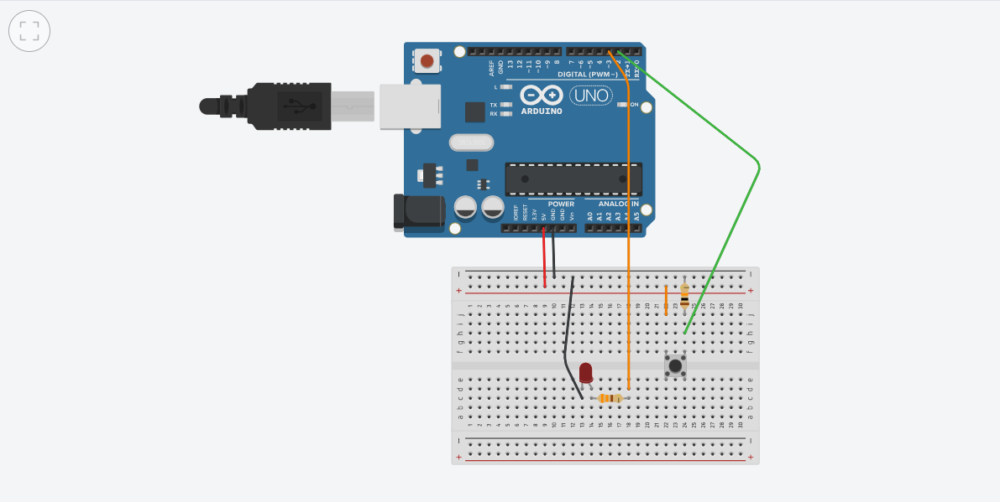

# Push Button LED Toggle

Arduino project for toggling an LED with a push button, using software debouncing.  
Solo project.

## Features
- Toggles LED on button press/release
- Software debounce via while loops (no delay())
- Responsive main loop
- State tracking with digitalRead

## Wiring
- Button: Digital pin 2 (to GND)
- LED: Digital pin 3 (with resistor)

## How to Use
- Upload to Arduino board
- Press button to toggle LED

## Demo
  
Simulation https://www.tinkercad.com/things/eisB9GopDkJ-p3-yuliya?sharecode=6lwpe7-itD2_zmwo_BsbUrjYmd-fJDKAAm8HugNqbVQ
